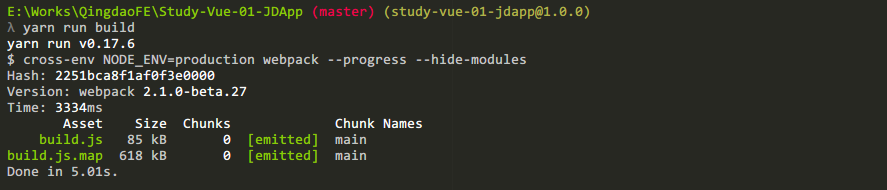

# Study-Vue-01-JDApp

> 学习-Vuejs-第一节-模仿京东APP页面
>
> 本页面需要在服务器环境下通过域名访问,勿直接浏览静态页面
>
> 框架基于Vue 2

***
## 使用技术:
* Vuejs             框架
* Sass/Less         样式预处理器
* Webpack           模块打包
* Babel             ES6转译ES5工具
* Yarn              模块依赖安装

***

## Components Structure / 组件结构说明:
```
App.vue (根节点)
    |
    |_ Header.vue (顶部)
        |
        |_ *.vue (导航按钮)
    |
    |_ Content.vue (内容)
        |
        |_ *.vue (内容小组件)

```

***

## Project structure / 项目结构
```bash
study-vue-01-jdapp/
    |
    |- index.html                       // HTML页面
    |
    |- package.json                     // NPM依赖环境 / NPM 运行命令
    |
    |- webpack.config.js                // Webpack配置文件
    |
    |- .babelrc                         // Babel配置文件
    |
    |- .editorconfig                    // 编辑器统一风格样式文件
    |
    |- .gitignore                       // Git忽略文件记录LICENSE
    |
    |- LICENSE                          // 开源协议(禁止闭源使用本项目)data.json
    |
    |- data.json                        // 模拟数据文件
    |
    |- dist/                            // 打包
    |
    |- src/                             // 开发
        |
        |- assets/                      // 静态资源
        |
        |- components/                  // Vue组件
        |
        |- App.vue                      // 根组件
        |
        |- main.js                      // Webpack处理文件
```

***

## Build Setup / 开发流程

``` bash
# install dependencies/拉取项目,在项目路径下执行
# 国内环境建议使用cnpm install
npm install

# *推荐Yarn
yarn install

# serve with hot reload at localhost:8080
# npm安装依赖后,运行node服务器,打开 localhost:80 预览 (已运行热更新功能)
npm run dev

# build for production with minification
# 当修改代码后,需要手动打包发布时,运行npm run build命令进行打包
npm run build
```

> 测试打包 `yarn run build`



关于Vue-loader的文档可在此处阅读 [docs for vue-loader](http://vuejs.github.io/vue-loader).

## 测试机器: iPhone 6s

## 测试浏览器: Chrome/Safari/FireFox/微信
